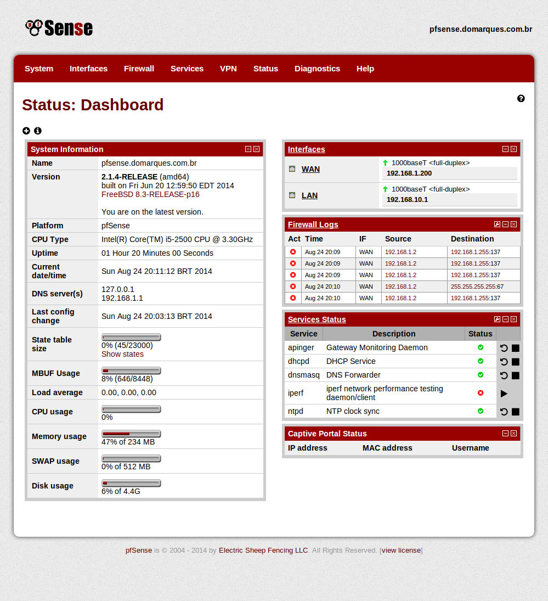

Domarques pfSense theme
========

**Simple** customization of "the wall" theme. Some adjustments on styles, font size and interface width (fluid).

A 5 minute work, so, please, don't expect a perfect custom theme. I've done a quick check and most of pages are ok.

~~Maybe i'll change the UI icons using font awesome.~~ Done =D

Compatibility
========

The theme was made using pfSense 2.1.4-RELEASE. I can't determine, right now, if is compatible with previous versions.

Still need some test on other browsers. Just checked on latest version of chrome and firefox.

I'm not planning modernize the theme, using HTML5/CSS3 and/or responsiveness.

Installation
--------

Place theme files under:

> /usr/local/www/themes/

Download (git or zip) and upload files:

    git clone https://github.com/domarques/pfsense-domarques-theme.git domarques
    scp -r domarques root@ip_or_fqdn_of_pfsense:/usr/local/www/themes/

Go to and set theme option *domarques*.

    http://ip_or_fqdn_of_pfsense/system.php

Customizing colors
=========

If you want change the color scheme, just replace the default color (red -> #900 ) to the desired color. As example:

    sed -i .bk 's/#900/#069/g' /usr/local/www/themes/domarques/{all,new_tab_menu}.css

`Sed` will replace color on both required files (*all.css* and *new_tab_menu.css*), plus will make an backup (*all.css.bk* and *new_tab_menu.css.bk*).

Note that i'm using hex color shorthand, but you can use any css color module (rgb, hsl, hwb etc.).

Preview: http://prntscr.com/4h0c61

Screenshot
--------

